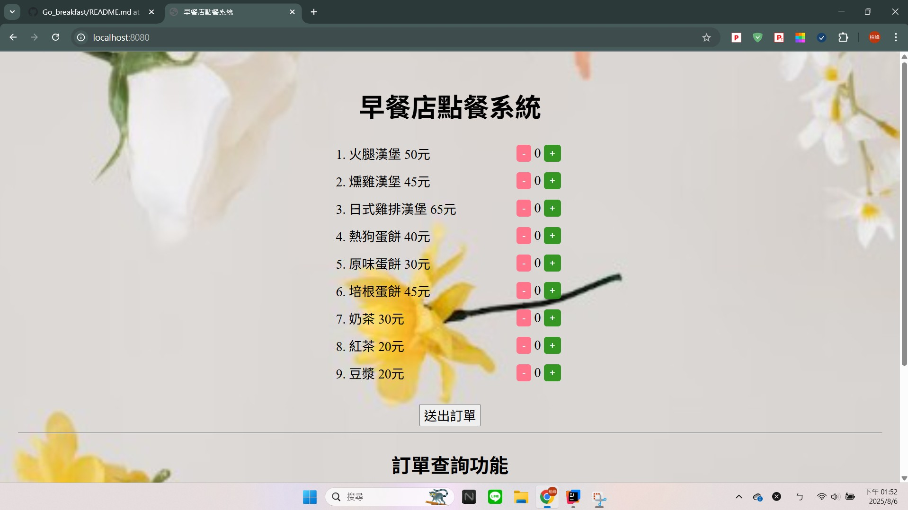
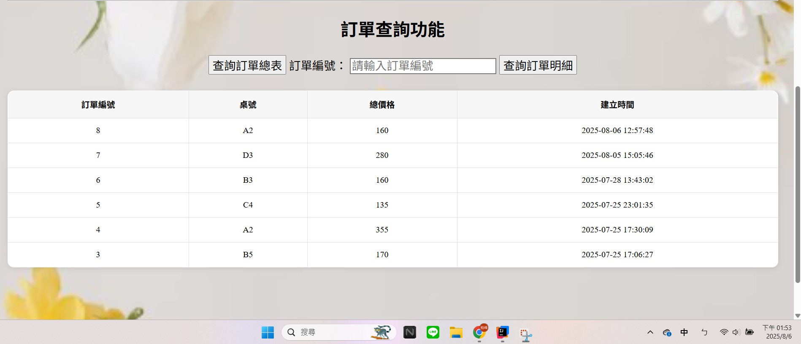
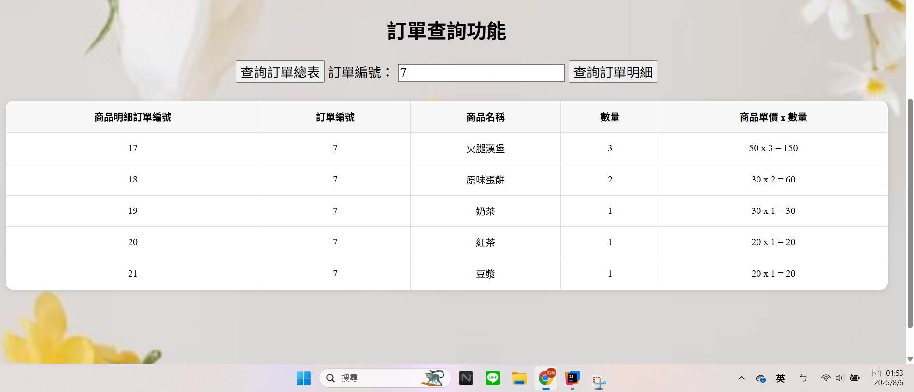

# \# SpringBoot 早餐店點餐系統

 

第一個圖片為點餐畫面，一共有9個商品，數量增減可以使用+和-按鈕做選取，確認好數量後，選擇桌號，例如:A1這樣。

按下送出訂單按鈕，後端會將資料儲存到MySQL資料庫內。

&nbsp;	

 

第二個圖片為查詢訂單總表，可以看到所有的訂單資訊

 	

 

第三個圖片為查詢特定編號訂單，例如我想要查詢order\_id: 7，按下按鈕即可取得訂單編號7的商品詳細資訊

 	

 

